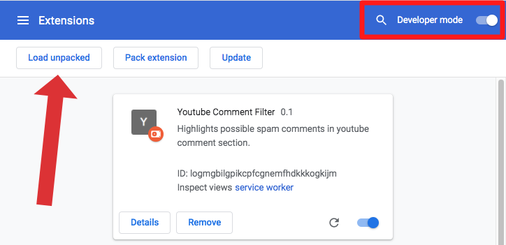
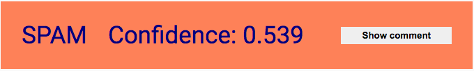
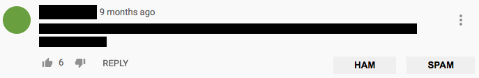

# YT-comment-filter

Chrome extension to mark spam comments on videos.

# Load unpacked extension in Google Chrome

This guide is a copy of the section "Create manifest" at [Chrome developer extensions - Get started](https://developer.chrome.com/docs/extensions/mv3/getstarted/)

1. Open the Extension Management page by navigating to <code>chrome://extensions</code>.

   - Alternatively, open this page by clicking on the Extensions menu button and selecting **Manage Extensions** at the bottom of the menu.
   - Alternatively, open this page by clicking on the Chrome menu, hovering over **More Tools** then selecting **Extensions**

2. Enable Developer Mode by clicking the toggle switch next to **Developer mode**.

3. Click the **Load unpacked** button and select the extension directory.

Troubleshooting:

- Comments are not filtered?
  - Start backend.
  - Reload extension (Reload icon, bottom right corner of the extension card element in the image above)
  -

# Using the extension

Make sure the backend is running. Instructions for starting the backend can be found in the Readme of the backend.

1. Open YouTube watch page, i.e. any video on YouTube.

2. Navigate to comment section.

3. Eventually some comments should be covered by an element similar to the image below.

4. Clicking the **Show comment** button will hide the cover and show feedback buttons

5. Feedback on the classification can be given by clicking either _ham_ or _spam_. The feedback is then stored in the backend.

